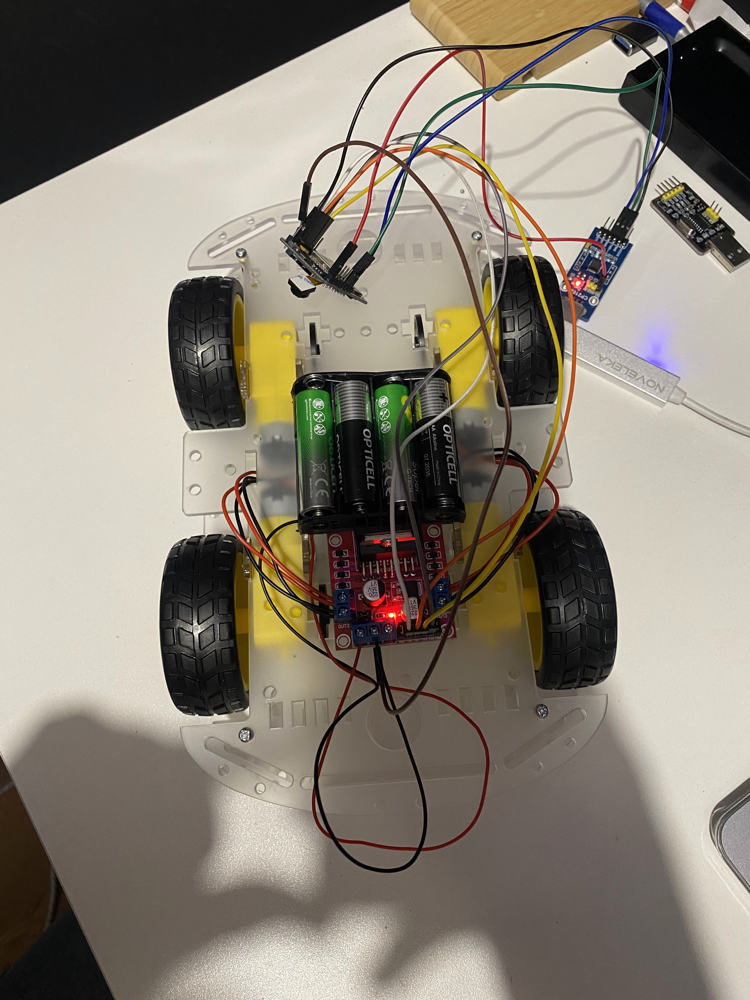
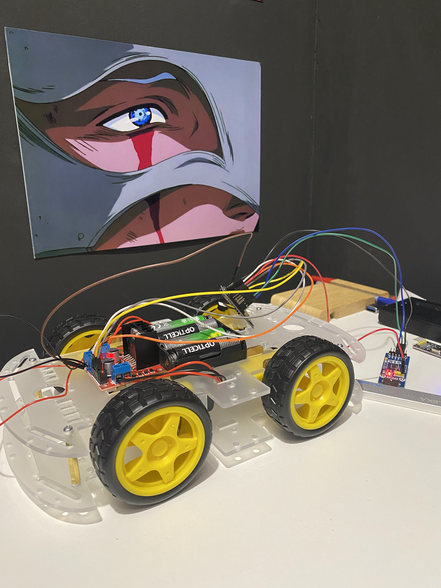

# MindSwarm — Рой мини-роботов на ESP32-CAM

Проект по созданию **роевой системы** автономных роботов в стиле насекомых.  
Первый прототип — **наземный муравей (GroundBot)** с 4WD шасси.

## Текущий статус (март 2026)

**Что уже работает:**
- Полностью собранное 4WD шасси с 4 моторами и драйвером
- ESP32-CAM успешно прошивается и работает
- Управление движением через Serial Monitor (команды: `f`, `b`, `l`, `r`, `s`)
- Подключение к Wi-Fi

## Технологии
- **Микроконтроллер**: ESP32-CAM (Ai-Thinker)
- **Язык**: C++ (Arduino IDE)
- **Драйвер моторов**: L298N / MX1508
- **Связь**: Wi-Fi

## Как запустить
1. Открой файл `code/ant_v1.ino` в Arduino IDE
2. Выбери плату **AI Thinker ESP32-CAM**
3. Загрузи скетч
4. Открой Serial Monitor (115200 baud)
5. Используй команды:
   - `f` — вперёд
   - `b` — назад
   - `l` — налево
   - `r` — направо
   - `s` — стоп

## Фото и видео робота

**Видео движения:**  
[Смотреть видео](media/robot_moving.mp4)

## Структура проекта 
- 'code/' - исходный код
- 'hardware/' - схемы фото подключений робота 
- 'media/' - фото и видео робота

## Следующие этапы
- Управление через Telegram-бот
- Работа с камерой OV2640 (фото/видео)
- Роевая связь между несколькими роботами (MQTT)
- Добавление "усов", LED-глаз и простой навигации

## Навыки, полученные в проекте
- Работа с ESP32 (GPIO, PWM, Wi-Fi)
- Управление DC-моторами и драйверами
- Отладка hardware + software
- Создание реального физического робота с нуля
- Основы IoT и беспроводного управления

---

**Автор**: Rifat, 27 лет  
**Цель проекта**: Получить практический опыт embedded-разработки и собрать сильное портфолио для junior embedded / IoT / robotics позиций.

Дата начала: март 2026

